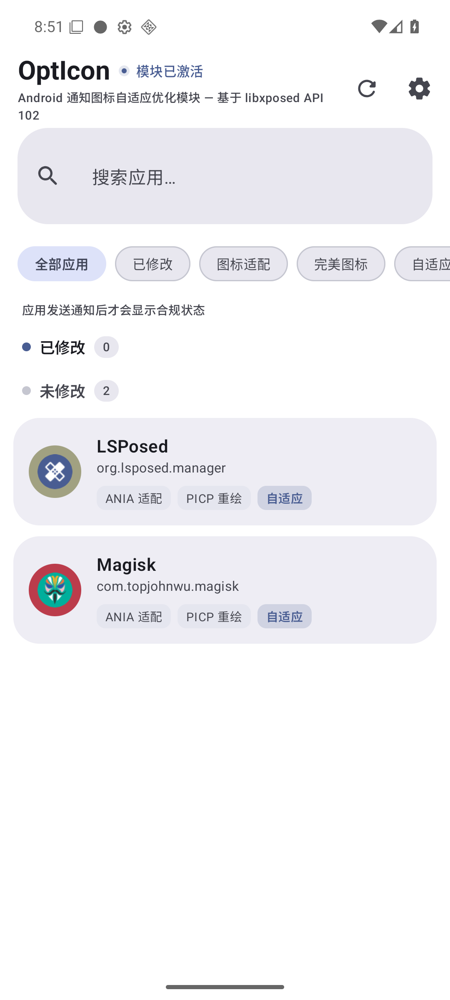
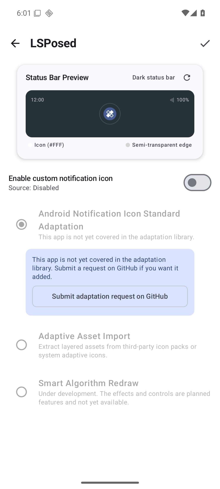
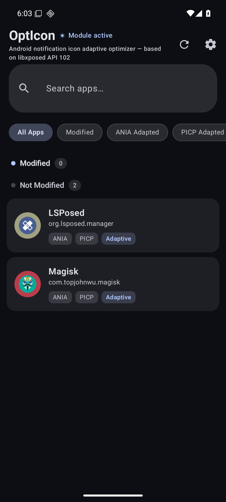

<div align="center">

# OptIcon

**Notification icon normalizer for Android — covering the full Material You generation**

Make every notification icon comply with native Android design guidelines

[简体中文](README.md) · [English](README_EN.md)

[](LICENSE)
[(#-compatibility)
[(https://github.com/libxposed/api)

</div>

---

> **OptIcon** is an [LSPosed](https://github.com/LSPosed/LSPosed) module that replaces non-compliant colorful notification icons with native Android Material You style icons.

## ✨ Features

### Three-tier icon supply strategy

| Strategy | Description | Source |
|---|---|---|
| **Notification icon adaptation** | Ready-to-use rule set covering 673+ mainstream apps | [AndroidNotifyIconAdapt](https://github.com/fankes/AndroidNotifyIconAdapt) (ANIA) |
| **Adaptive asset import** | Layered extraction from third-party icon packs or system adaptive icons | Local + [Perfect-Icons-Completion-Project](https://github.com/pzcn/Perfect-Icons-Completion-Project) (PICP) |
| **Algorithmic redraw** 🚧 | Corner-sampling self-filter algorithm — generates compliant icons even without rules (**WIP**: engine pipeline ready; entry point and control panel not yet exposed) | Built-in engine |

### Runtime compliance detection

Whenever an app posts a notification, OptIcon automatically evaluates whether its native icon is compliant and tags it as "Compliant / Non-compliant" in the app list — so you can see exactly which apps are breaking your status bar consistency.

### More

- 🔴 **Full heads-up coverage** — replacement across the shade list, heads-up banners, and lock screen
- 🎨 **Material You dynamic color** — light & dark themes following the system wallpaper palette
- ⚡ **Hot reload** — icon changes apply without restarting; monitored by FileObserver
- 🌐 **Multilingual ready** — Chinese/English out of the box, extensible to any language
- 🔒 **Zero network dependency (optional)** — rule sets are downloaded on demand; no subscription, no telemetry

## 📸 Screenshots

<p float="left">
  
  
  
</p>

## 🚀 Installation

### Requirements

- Android 12+ (API 31, the first Material You release)
- Rooted device with [Magisk](https://github.com/topjohnwu/Magisk) (Zygisk) / KernelSU / SukiSU
- [LSPosed](https://github.com/LSPosed/LSPosed) v2.0+ (libxposed API 102)

### Steps

1. Install the OptIcon APK
2. Enable the module in LSPosed Manager and check **System UI** as its scope
3. Restart SystemUI (or reboot)
4. Open OptIcon and sync the rule set in Settings
5. Pick an app in the list → choose a strategy → save

## 🛠️ How it works

```
┌────────────┐   rules / baked icons    ┌──────────────────┐
│  OptIcon   │ ───────────────────────▶ │  Download/OptIcon │  (shared public dir)
│ (app proc) │     MediaStore writes    │ (icons / switches) │
└────────────┘                          └────────┬─────────┘
                                                 │ direct File API reads
┌────────────┐   hook createIcons                ▼
│  SystemUI  │ ◀──── replace smallIcon ── IconManager pipeline
└────────────┘   (heads-up / shade / lock screen)
```

- **Path A**: the app writes to a shared public directory via MediaStore; the SystemUI hook reads it directly (the mass-deployment pattern proven by [Iconify](https://github.com/MohamedRejworkshop/Iconify))
- **Compliance detection**: piggybacks on the existing createIcons hook, measuring the original icon's monochromaticity at near-zero cost

## 🤝 Credits

Special thanks to the following projects and developers (mirrors the in-app credits):

- **[fankes / AndroidNotifyIconAdapt](https://github.com/fankes/AndroidNotifyIconAdapt)** — special thanks to fankes for generously authorizing this project to use the team's 673+ app adaptation rule set of the "Android Notification Icon Standard Adaptation" project.
- **[pzcn / Perfect-Icons-Completion-Project](https://github.com/pzcn/Perfect-Icons-Completion-Project)** — thanks to the PICP team for their selfless contribution to the Android icon ecosystem.
- **[Howard20181 / NotificationIconFix](https://github.com/Howard20181/NotificationIconFix)** — thanks to Howard20181; the technical approach was an important source of inspiration.
- **[MohamedRejworkshop / Iconify](https://github.com/MohamedRejworkshop/Iconify)** — thanks to Iconify; its cross-process icon delivery pipeline (shared-directory pattern) served as an architecture reference.
- **[LSPosed Team](https://github.com/LSPosed)** — the foundation of everything. Thank you.

## 🔐 Permission disclosure (QUERY_ALL_PACKAGES)

OptIcon requests the `QUERY_ALL_PACKAGES` permission **solely to enumerate installed apps that may send notifications**, so the user can configure icon strategies per app — notifications do not only come from apps with launcher entries (on a real device, 41% of packages lack a launcher activity, including high-frequency notifiers like Play services). OptIcon collects nothing, uploads nothing, and contains no telemetry.

## ⚠️ Disclaimer

> This is a **hobby project** provided "as is", without any express or implied warranty.
>
> - **No functional guarantees**: the author makes no promise that any feature works on your device, ROM, or OS version; vendor-specific behavior (MIUI / ColorOS / HyperOS, etc.) may cause unpredictable differences.
> - **No development commitments**: the author makes no commitments regarding future plans, schedules, roadmaps, or continued maintenance; the project may slow down, pause, or be archived at any time.
> - **Use at your own risk**: any consequence of using it (including but not limited to SystemUI issues, lost notifications, or battery impact) is at the user's own risk. Enabling root / Xposed modules carries inherent risks.
> - **No affiliation**: this project is not affiliated with Google, Android, OnePlus, or any vendor/project mentioned; all trademarks belong to their respective owners.
> - **Your call**: how you use it is entirely up to you; the developer is not responsible for any misuse.

## 🤖 AI Disclosure

> This project was developed with substantial AI (LLM) assistance — architecture, implementation, testing, and documentation; the human ([@deserthouse](https://github.com/deserthouse)) provides requirements, acceptance testing, and final decisions.

## ⚖️ License

This project is open-sourced under the [AGPL-3.0](LICENSE) license.

- The ANIA rule set (AGPL-3.0) is consumed via runtime download and is not bundled or redistributed
- PICP icon assets are downloaded on demand for personal use and are not redistributed (see its repository for details)

## 📊 Compatibility

| Item | Support |
|---|---|
| Minimum | Android 12 (API 31) |
| Target | Android 17 (API 37) |
| Verified | API 36 end-to-end (AOSP emulator + LSPosed v2.2.0); Android 17 (OOS real device) |
| Custom ROMs | AOSP as the mainline; OOS (OnePlus 15) as the primary real-device environment — others theoretically work, untested |

---

<div align="center">

If this project helps you, a ⭐ is appreciated

</div>
